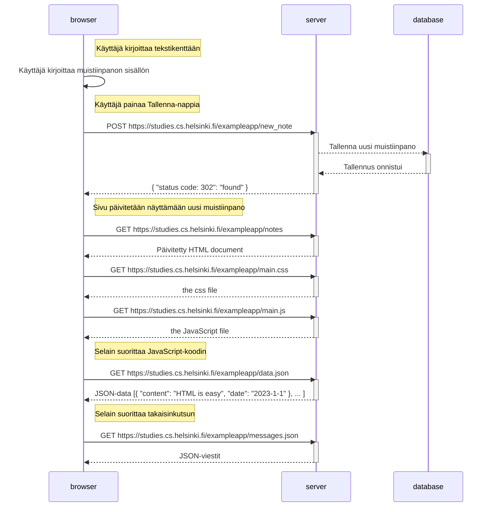

```mermaid
sequenceDiagram
    participant browser
    participant server
    participant database
    
    Note right of browser: Käyttäjä kirjoittaa tekstikenttään
    
    browser->>browser: Käyttäjä kirjoittaa muistiinpanon sisällön
    
    Note right of browser: Käyttäjä painaa Tallenna-nappia
    
    browser->>server: POST https://studies.cs.helsinki.fi/exampleapp/new_note
    activate server
    server-->>database: Tallenna uusi muistiinpano
    activate database
    database-->>server: Tallennus onnistui
    deactivate database
    server-->>browser: { "status code: 302": "found" }
    deactivate server
    
    Note right of browser: Sivu päivitetään näyttämään uusi muistiinpano
    
    browser->>server: GET https://studies.cs.helsinki.fi/exampleapp/notes
    activate server
    server-->>browser: Päivitetty HTML document
    deactivate server
    
    browser->>server: GET https://studies.cs.helsinki.fi/exampleapp/main.css
    activate server
    server-->>browser: the css file
    deactivate server
    
    browser->>server: GET https://studies.cs.helsinki.fi/exampleapp/main.js
    activate server
    server-->>browser: the JavaScript file
    deactivate server
    
    Note right of browser: Selain suorittaa JavaScript-koodin
    browser->>server: GET https://studies.cs.helsinki.fi/exampleapp/data.json
    activate server
    server-->>browser: JSON-data [{ "content": "HTML is easy", "date": "2023-1-1" }, ... ]
    deactivate server
    
    Note right of browser: Selain suorittaa takaisinkutsun
    browser->>server: GET https://studies.cs.helsinki.fi/exampleapp/messages.json
    activate server
    server-->>browser: JSON-viestit
    deactivate server
```
