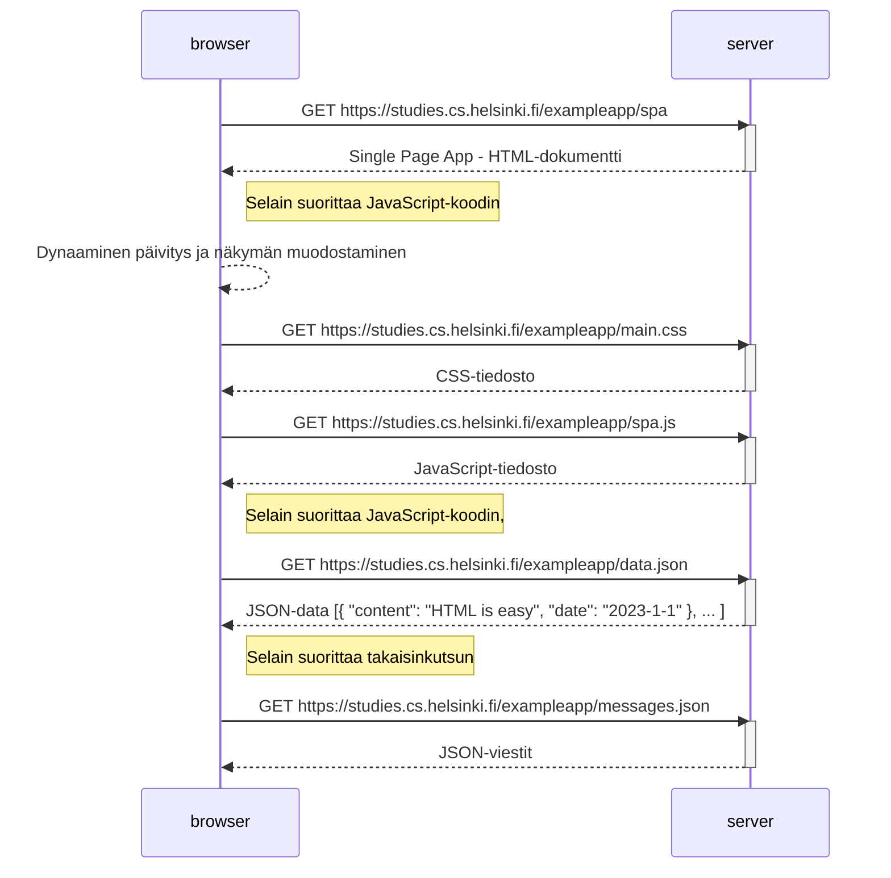

```mermaid
sequenceDiagram
    participant browser
    participant server
    
    browser->>server: GET https://studies.cs.helsinki.fi/exampleapp/spa
    activate server
    server-->>browser: Single Page App - HTML-dokumentti
    deactivate server
    
    Note right of browser: Selain suorittaa JavaScript-koodin
    browser-->>browser: Dynaaminen päivitys ja näkymän muodostaminen
    
    browser->>server: GET https://studies.cs.helsinki.fi/exampleapp/main.css
    activate server
    server-->>browser: CSS-tiedosto
    deactivate server
    
    browser->>server: GET https://studies.cs.helsinki.fi/exampleapp/spa.js
    activate server
    server-->>browser: JavaScript-tiedosto
    deactivate server
    
    Note right of browser: Selain suorittaa JavaScript-koodin,
    browser->>server: GET https://studies.cs.helsinki.fi/exampleapp/data.json
    activate server
    server-->>browser: JSON-data [{ "content": "HTML is easy", "date": "2023-1-1" }, ... ]
    deactivate server
    
    Note right of browser: Selain suorittaa takaisinkutsun
    browser->>server: GET https://studies.cs.helsinki.fi/exampleapp/messages.json
    activate server
    server-->>browser: JSON-viestit
    deactivate server
```
