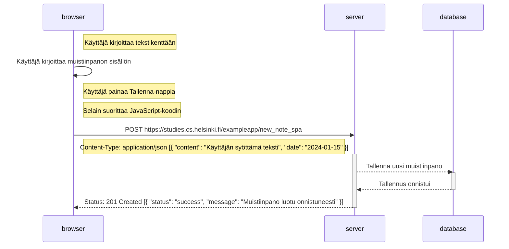

```mermaid
sequenceDiagram
    participant browser
    participant server
    participant database
    
    Note right of browser: Käyttäjä kirjoittaa tekstikenttään
    
    browser->>browser: Käyttäjä kirjoittaa muistiinpanon sisällön
    
    Note right of browser: Käyttäjä painaa Tallenna-nappia
    
    Note right of browser: Selain suorittaa JavaScript-koodin
    browser->>server: POST https://studies.cs.helsinki.fi/exampleapp/new_note_spa
    Note right of browser: Content-Type: application/json [{ "content": "Käyttäjän syöttämä teksti", "date": "2024-01-15" }]

    activate server
    server-->>database: Tallenna uusi muistiinpano
    activate database
    database-->>server: Tallennus onnistui
    deactivate database
    server-->>browser: Status: 201 Created [{ "status": "success", "message": "Muistiinpano luotu onnistuneesti" }]
    deactivate server
```
